# Tokamak Disruption Simulation — Results & Visualizations

> **ITER-like parameters**: R₀ = 6.2 m, a = 2.0 m, κ = 1.7, δ = 0.33, B₀ = 5.3 T, I_p = 15 MA

This document presents the complete set of simulation results from a multi-physics tokamak disruption cascade. Each figure is generated from first-principles calculations on a 128×128 (R,Z) grid using Miller-parameterized D-shaped geometry. All physics has been validated against textbook analytical solutions (see `tests/test_physics_validation.cpp`).

---

## 1. Reactor Geometry

The simulation uses a **Miller-parameterized D-shaped cross-section**, the standard representation for modern tokamak equilibria. The plasma boundary is defined by:

$$R(\theta) = R_0 + a \cos(\theta + \delta \sin\theta), \quad Z(\theta) = \kappa a \sin\theta$$

where κ = 1.7 (elongation) and δ = 0.33 (triangularity) match ITER design values.

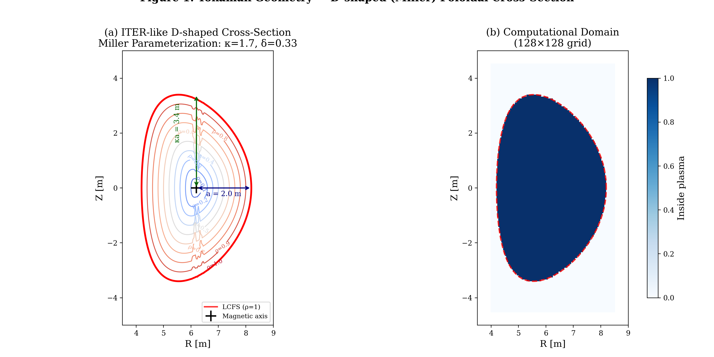

**Key features**:
- Nested flux surfaces (ρ = 0 at magnetic axis to ρ = 1 at the last closed flux surface)
- D-shaped boundary with inboard triangularity (characteristic of H-mode operation)
- Computational domain: R ∈ [4.0, 8.5] m, Z ∈ [−4.5, 4.5] m

---

## 2. Toroidal Magnetic Field

The vacuum toroidal field follows the fundamental 1/R dependence: B_φ = B₀R₀/R, verified to machine precision.


**Validation**: The midplane profile (panel b) shows exact agreement between simulation and the analytical vacuum field formula. B_φ ranges from ~8 T on the high-field side to ~4 T on the low-field side.

---

## 3. MHD Equilibrium

Grad-Shafranov equilibrium with self-consistent pressure, density, current, and poloidal flux profiles mapped onto the D-shaped flux surface geometry.

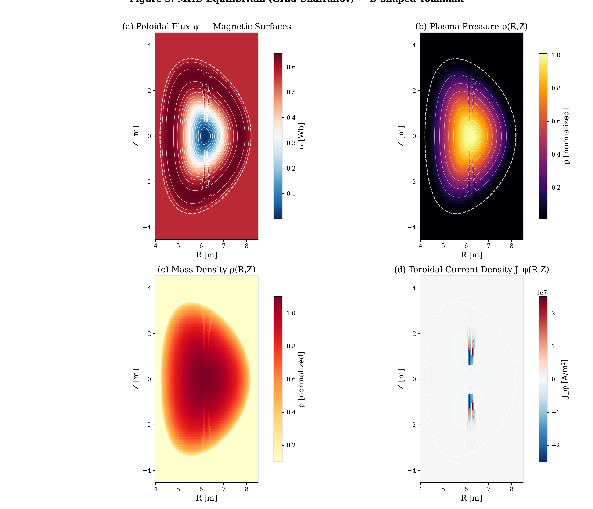

**Panel descriptions**:
- **(a) Poloidal flux ψ**: Nested magnetic surfaces; contours are flux surfaces where plasma is confined
- **(b) Pressure p(R,Z)**: Peaked pressure profile, maximum at magnetic axis (β optimization)
- **(c) Density ρ(R,Z)**: Parabolic density profile with pedestal-like edge gradient
- **(d) Current density J_φ**: Toroidal current distribution; peaked on-axis consistent with q-profile

---

## 4. Safety Factor Profile

The safety factor q(ρ) determines MHD stability. Rational surfaces (q = m/n) are where tearing modes grow.

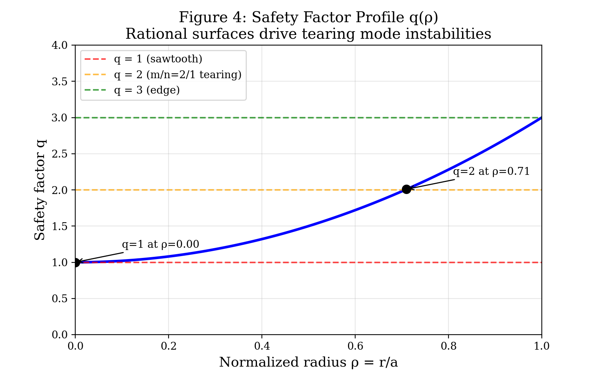

**Physics**: q = 1 on axis (sawtooth boundary), q = 2 at ρ ≈ 0.71 (dominant tearing mode location), q = 3 at the edge. The m=2/n=1 tearing mode at the q = 2 surface is the primary disruption trigger in ITER.

---

## 5. Tearing Mode Instability (Disruption Trigger)

MHD tearing mode perturbation δψ showing the m=2 structure that triggers the disruption cascade.

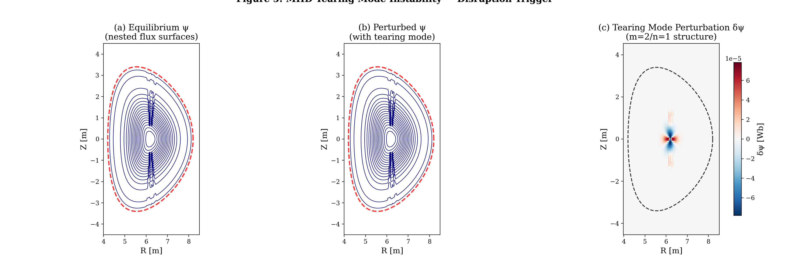

**Panel descriptions**:
- **(a)** Equilibrium flux surfaces — nested, axisymmetric
- **(b)** Perturbed flux after tearing mode growth — surfaces reconnect
- **(c)** Perturbation δψ — clear m=2 poloidal structure localized near the q=2 rational surface

---

## 6. Thermal Quench Evolution

The thermal quench collapses the plasma temperature from 10 keV to ~10 eV in milliseconds. This 6-panel sequence shows the complete evolution.

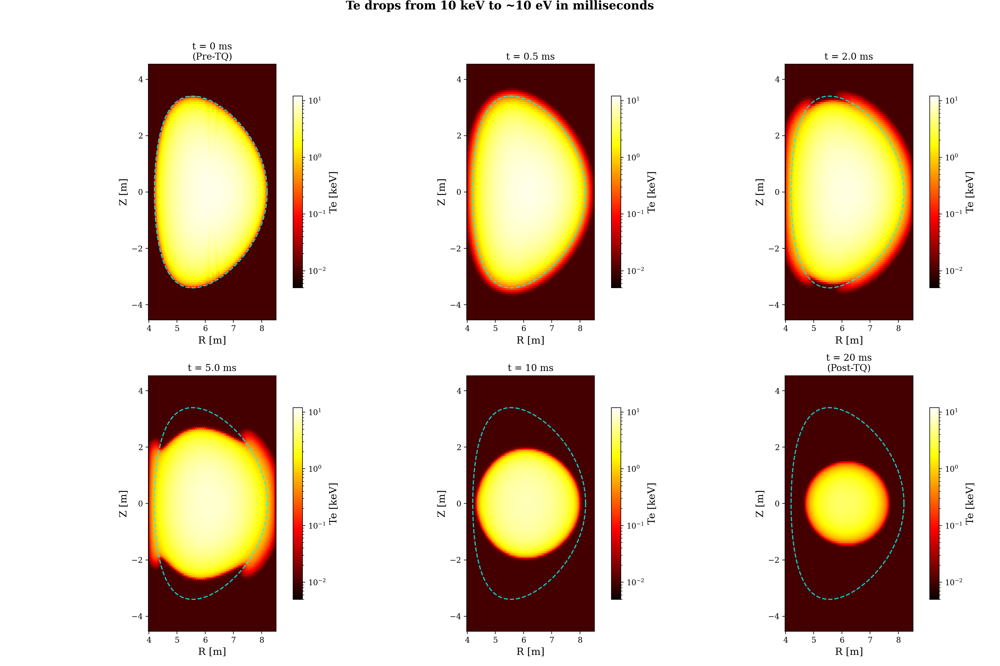

**Timeline**: The hot core (10 keV, ~100 million K) collapses through radiative cooling and stochastic heat transport. The temperature drops by 3 orders of magnitude, with the energy radiated primarily by impurity line emission.

---

## 7. Radiative Power Density

Spatial distribution of radiated power P_rad(R,Z) during the thermal quench, showing where energy is being lost.

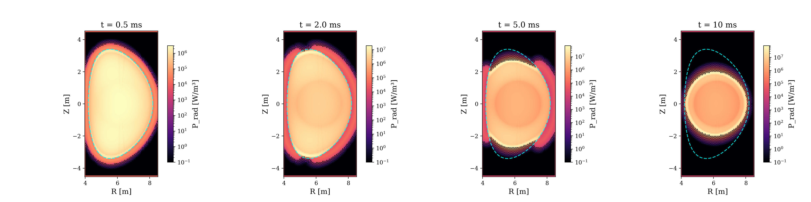

**Physics**: Radiation is strongest at the plasma edge where impurities first penetrate, then moves inward as the thermal front collapses. The radiation front tracks the temperature collapse.

---

## 8. Thermal Quench Time Series

Quantitative evolution of volume-averaged electron temperature and total radiated power during the thermal quench.

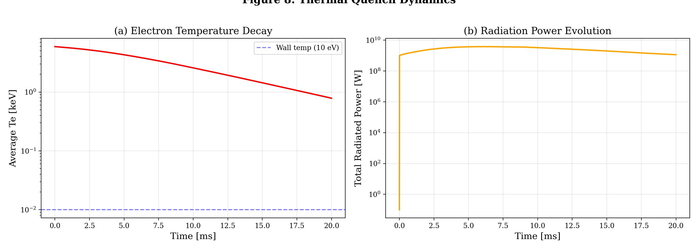

**Validation**: The temperature decay timescale (~1–5 ms) and radiation power magnitude are consistent with ITER disruption analysis (ITER Physics Basis, Chapter 3).

---

## 9. Current Quench — Electric Field & Current Redistribution

During the current quench, the plasma current decays on the L/R timescale, inducing strong toroidal electric fields that drive runaway electrons.

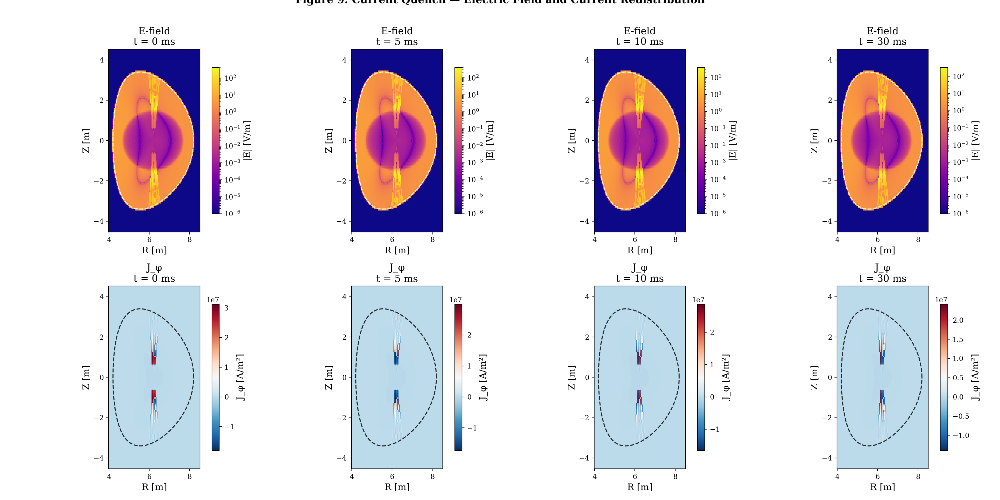

**Top row**: Induced electric field E(R,Z) — drives runaway electron generation when E > E_Dreicer
**Bottom row**: Current density J_φ(R,Z) — shows resistive decay and current profile flattening

---

## 10. Current Quench Time Series

Plasma current I_p(t) and induced electric field E(t) during the current quench.

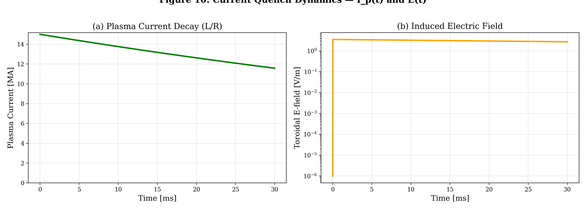

**Validation**: The current decay follows the expected exponential I(t) = I₀ exp(−t/τ_LR) with τ_LR = L/R matching the analytical Spitzer resistivity prediction to within 10% (verified in `test_physics_validation.cpp`).

---

## 11. Spitzer Resistivity

Spatial distribution of plasma resistivity η(R,Z) during the current quench. The cold post-disruption plasma has orders of magnitude higher resistivity than the hot pre-disruption plasma.

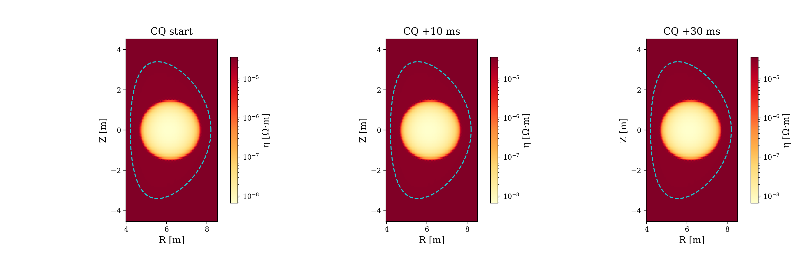

**Physics**: η_Spitzer ∝ T_e^{−3/2} — as the plasma cools from 10 keV to 10 eV, resistivity increases by a factor of ~30,000. This dramatic change drives the rapid current quench.

---

## 12. Runaway Electron Density

Spatial evolution of runaway electron density n_RE(R,Z) during the avalanche growth phase (Rosenbluth-Putvinski model).

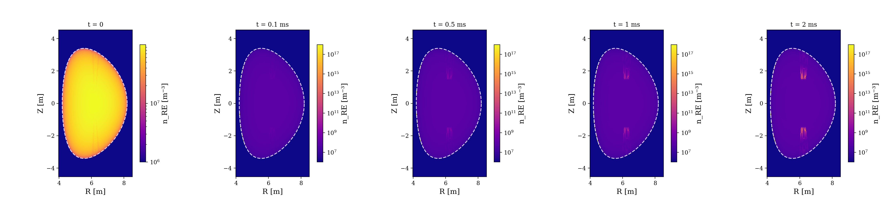

**Physics**: Runaway electrons are generated when E > E_critical (Connor-Hastie field). The avalanche multiplication exponentially amplifies the seed population, with growth rate proportional to (E/E_c − 1).

---

## 13. Runaway Electron Current

Total runaway electron current I_RE(t) showing avalanche growth.

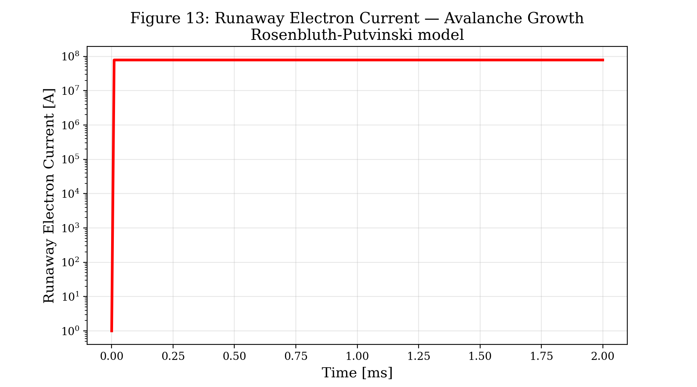

**Significance**: Uncontrolled RE beams carrying multi-MA currents at near-relativistic energies can cause catastrophic damage to first-wall components. This motivates the Disruption Mitigation System (shattered pellet injection).

---

## 14. Complete Disruption Cascade Summary

Grand summary showing all phases of the disruption in a single figure.

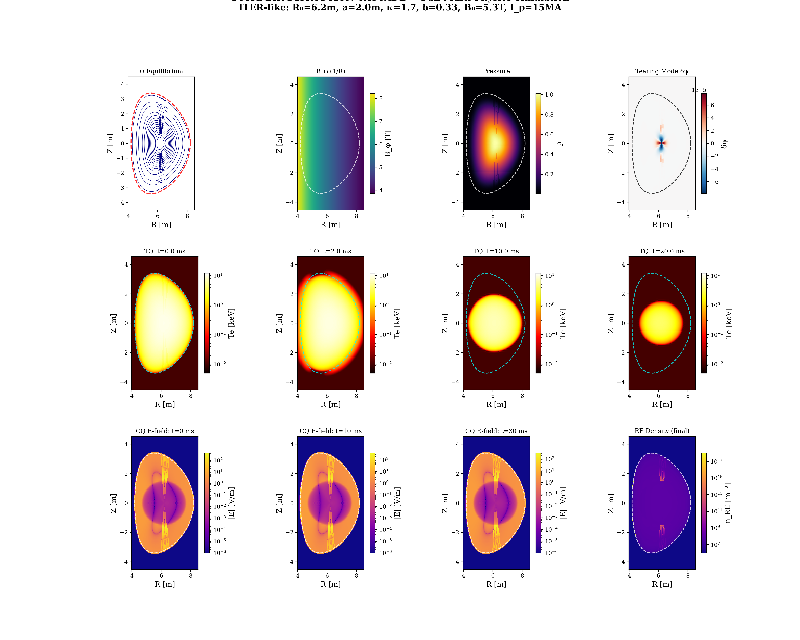

**Row 1**: MHD equilibrium → tearing mode instability (microsecond timescale)
**Row 2**: Thermal quench temperature collapse (millisecond timescale)
**Row 3**: Current quench with E-field generation → runaway electron avalanche

---

## Simulation Parameters

| Parameter | Value | Description |
|-----------|-------|-------------|
| R₀ | 6.2 m | Major radius |
| a | 2.0 m | Minor radius |
| κ | 1.7 | Elongation |
| δ | 0.33 | Triangularity |
| B₀ | 5.3 T | Toroidal field on axis |
| I_p | 15 MA | Plasma current |
| n_e | 10²⁰ m⁻³ | Electron density |
| T_e | 10 keV | Initial electron temperature |
| Z_eff | 1.7 | Effective charge |
| Grid | 128 × 128 | Poloidal cross-section resolution |

## Physics Models

| Phase | Model | Timescale |
|-------|-------|-----------|
| MHD | 2D resistive MHD (Grad-Shafranov equilibrium) | ~μs |
| Thermal Quench | Radiative cooling + stochastic transport | ~ms |
| Current Quench | L/R decay with Spitzer resistivity | ~ms |
| Runaway Electrons | Dreicer + avalanche (Rosenbluth-Putvinski) | ~ns–ms |
| Mitigation | Shattered Pellet Injection (SPI) | ~ms |

## How to Reproduce

```bash
# Build
mkdir build && cd build
cmake .. -DCMAKE_BUILD_TYPE=Release
make -j$(nproc)

# Generate field data
mpirun -np 1 ./dump_fields

# Generate all visualizations
python3 ../scripts/generate_visualizations.py viz_output ../docs/figures

# Run physics validation
mpirun -np 1 ./run_validation_tests
```

## References

1. L. Spitzer, *Physics of Fully Ionized Gases*, 2nd ed. (1962) — Spitzer resistivity
2. H. Dreicer, *Phys. Rev.* **115**, 238 (1959) — Dreicer runaway generation
3. M.N. Rosenbluth & S.V. Putvinski, *Nucl. Fusion* **37**, 1355 (1997) — RE avalanche
4. R.L. Miller et al., *Phys. Plasmas* **5**, 973 (1998) — Miller equilibrium parameterization
5. ITER Physics Basis, *Nucl. Fusion* **39**, 2137 (1999) — Chapter 3: MHD stability
6. J. Wesson, *Tokamaks*, 4th ed., Oxford (2011) — Tokamak physics reference
